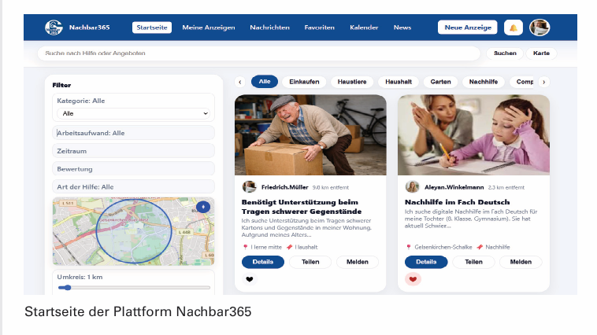
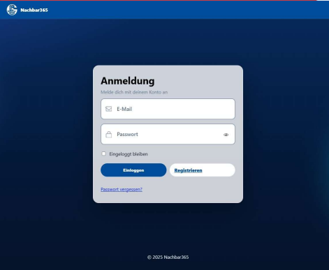
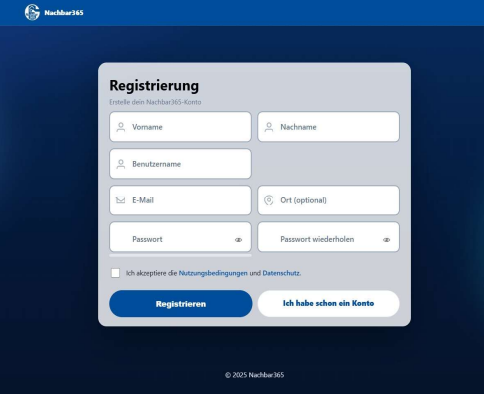
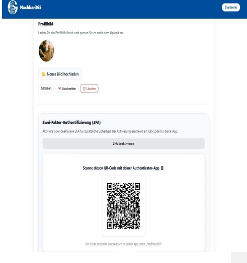
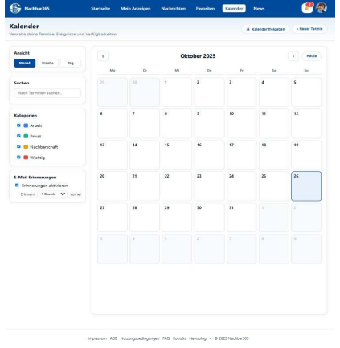
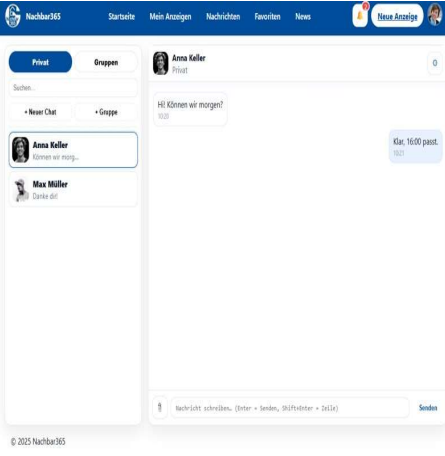
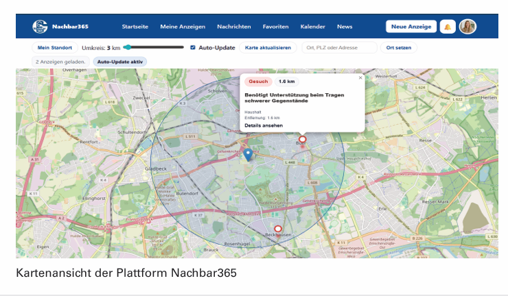

# Nachbar365 Showcase

A university software project for digital neighborhood support.

## Project overview
Nachbar365 is a web-based client-server application designed to support digital neighborhood interaction.

## My contribution
I contributed strongly to the technical implementation, especially in:
- backend development
- database integration
- REST communication
- security-related concepts
- frontend development

## Tech stack
- Java
- Spring Boot
- PostgreSQL
- REST / JSON
- JPA / Hibernate
- JWT Authentication
- RBAC
- HTML
- JS
- CSS

## Features
- User registration and login
- Search and filter functions
- Messaging / communication features
- Database-backed data management
- Role-based access control

## Screenshots

### Start Page

### Sign In

### Sign Up

### 2FA

### Calender

### Chats

### Map

## Notes
This repository is a public showcase version and documents the project structure, architecture and technologies used.

